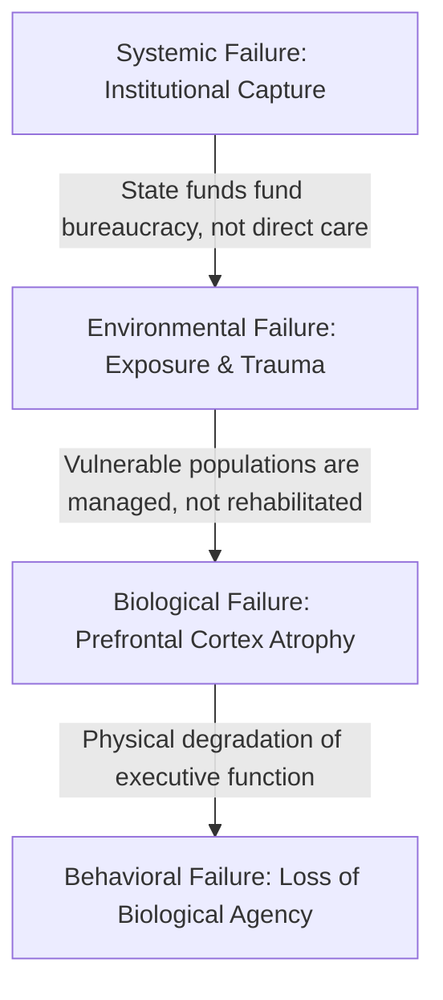

# Institutional Ethics: The Moral Physics of Survival

In social and care ethics, this principle asserts that a just society is judged by how it protects its weakest members. True moral duty requires directing resources, advocacy, and protection upward to those who cannot fend for themselves, rather than concentrating power at the top.

---

## Compelled Clinical Intervention and Biological Agency

The argument that the verified destruction of biological agency justifies compelled clinical intervention is a foundational premise in bioethics, medical law, and psychiatric care. When an individual completely loses the capacity for self-determination due to severe biological or neurological impairment, society often shifts from respecting autonomy to enforcing paternalistic protection.

### Philosophical and Legal Foundations

* Loss of Autonomy: Autonomous decision-making relies on intact cognitive and biological functioning. When disease, trauma, or severe psychiatric conditions destroy this agency, the individual can no longer choose their own path.
* The Principle of Beneficence: When agency is gone, the moral duty shifts to beneficence (acting in the person's best interest) and non-maleficence (preventing them from harming themselves or others).
* Parens Patriae: This legal doctrine grants the state the authority to intervene and act as the guardian for individuals who are unable to protect themselves due to a lack of capacity.

### High-Threshold Clinical Triggers

Compelled intervention is highly restricted and typically requires meeting rigorous, legally defined criteria:

* Imminent Risk of Harm: Clear evidence that the loss of agency poses a direct threat to the survival of the patient or the safety of others.
* Inability to Process Information: A clinical determination that the individual cannot understand the nature, risks, or benefits of treatment options.
* Temporary vs. Permanent Status: Interventions are ideally designed to restore agency (e.g., stabilizing a patient in an acute psychotic break or treating an overdose) rather than permanently usurping it.

### Ethical Controversies and Safeguards

Because compelling medical care infringes on bodily integrity, strict safeguards are required to prevent abuse:

* The Slippery Slope: Defining what constitutes "destruction of agency" is highly subjective. Clear boundaries prevent states or institutions from using forced treatment to enforce social conformity.
* Substituted Judgment: Whenever possible, clinicians and proxies must make decisions based on what the patient would have wanted when they possessed agency, rather than what the medical team prefers.
* Least Restrictive Alternative: Any compelled treatment must use the gentlest, least intrusive measures necessary to stabilize the biological threat and restore autonomy.

---

## The Principle of Inherent Dignity

This principle is known as inherent dignity. It states that human rights and moral worth belong to a person simply because they are human. They do not depend on intelligence, productivity, health, or social utility.
This idea directly opposes functionalism, which claims value must be earned through specific abilities.

### Core Foundations

* Inherent Worth: Dignity is an essential quality of being human. It cannot be granted by a government, and it cannot be taken away.
* Equality: Because dignity is tied to human nature, everyone has it equally. A newborn, a person with a profound disability, and a genius possess the exact same moral value.
* The Kantian Rule: Philosopher Immanuel Kant argued that people must always be treated as ends in themselves, never merely as a means to an end. Humans are not tools to be used based on their performance.

### Practical Implications

* Medical Ethics: This framework protects individuals with severe cognitive impairments or those in comas. It ensures they receive respectful care, even if they cannot contribute to society.
* Human Rights Law: The Universal Declaration of Human Rights starts by recognizing the "inherent dignity" of all humans. This protects marginalized groups from being devalued when they cannot meet certain performance standards.
* Vulnerability Advocacy: It shifts the focus from what a person can do to who a person is. This justifies the social safety nets and legal protections given to those who are most dependent on others.

---

## Neurobiological Degradation under Stress

Severe physiological and psychological stress directly causes structural degradation and functional collapse of the prefrontal cortex (PFC). When an individual experiences unmitigated exposure to the elements, sleep deprivation, and chronic trauma, the brain enters a state of hyper-arousal that fundamentally alters its neural architecture. This degradation deeply impairs executive functioning, decision-making, and emotional regulation.

### The Mechanisms of PFC Atrophy

* Synaptic and Dendritic Loss: Chronic stress triggers a massive release of catecholamines and cortisol. Over time, this toxic hormonal surge causes a loss of spines and dendritic atrophy within the PFC, physically weakening its neural pathways.
* Reduced Blood Flow: Sleep loss causes an immediate drop in blood flow and oxygen to the frontal lobes, severely dulling executive control and working memory.
* Failed Synaptic Pruning: Sleep deprivation prevents the brain from cleaning up metabolic waste and weak synapses, leaving the PFC bogged down in neural "noise".
* Inflammatory Damage: The combination of environmental exposure and sleep loss triggers systemic inflammation, causing neurobehavioral decline and accelerated brain tissue loss.

### The Functional Consequences

* Hyper-Reactive Amygdala: As the PFC degrades, it loses its ability to exert top-down control over the brain's emotional center. The amygdala becomes up to 60% more reactive, driving permanent hyper-vigilance, impulsivity, and severe emotional dysregulation.
* Impaired Decision-Making: Individuals lose the capacity for cognitive flexibility, long-term planning, and risk assessment.
* Memory and Attention Lapses: Disrupted sleep and trauma directly shrink the hippocampus and fragment memory consolidation, making sustained attention virtually impossible.

### Real-World Implications: The Cycle of Unstable Housing

This neurological breakdown creates a catastrophic feedback loop for individuals experiencing homelessness or displacement. Studies utilizing brain MRIs on youth and adults impacted by homelessness show a significant decrease in regional gray matter tissue within the prefrontal cortex.
The brain changes match behavioral indicators of frontal lobe dysfunction: apathy, disinhibition, and poor conflict resolution. Society often misinterprets the resulting behavioral choices as personal or moral failures, when they are actually the direct, predictable output of a structurally damaged brain.

---

## Bureaucratic Drift and Institutional Capture

This phenomenon is known as bureaucratic drift or mission creep, and it is modeled in economics as public choice theory. It explains how organizations created for altruistic purposes, such as housing the unhoused, treating chronic trauma, or managing public health crises, eventually shift their primary goal from solving the problem to maintaining their own budgets, staff, and institutional survival.

### The Mechanics of Institutional Capture

* Budget-Maximizing Behavior: Economist William Niskanen argued that bureaucrats seek to maximize their agency's budget. Larger budgets grant status, job security, and promotion opportunities, creating an incentive to justify continued or expanded funding rather than solving the root problem.
* Perverse Incentives for Problem Retention: If an institution completely solves the crisis it was funded to fix, its social utility drops to zero, and its funding disappears. Consequently, internal incentives reward managing the problem continuously rather than eradicating it permanently.
* The "Iron Triangle": A self-reinforcing alliance forms between the executive agency administering the programs, the legislative committees controlling the funding, and the interest groups or non-profits receiving the state grants. This structure naturally blocks outside reform or disruptive, more efficient solutions.

### Structural Signs of Self-Preservation

* Metric Manipulation: Institutions shift focus from outcomes (e.g., How many people recovered from PFC trauma and secured stable lives?) to outputs (e.g., How many beds were occupied tonight?).
* Administrative Bloat: A disproportionate share of new state funding goes toward administrative overhead, compliance officers, and executive salaries rather than direct, front-line services.
* Barrier Creep: Agencies erect steep regulatory barriers that make it difficult for smaller, highly innovative, or grassroots competitors to access state funds, ensuring the monopoly remains secure.

### The Impact on Vulnerable Populations

When institutions prioritize self-preservation, the vulnerable individuals at the "summit of moral obligation" suffer the most. Because these individuals suffer from the structural brain damage and loss of agency caused by trauma and exposure, they cannot effectively lobby against inefficient systems. They become a permanent client class, trapped inside a cycle of institutional management rather than genuine rehabilitation and empowerment.

---

## Empirical Ethics as a Causal Science

When ethical reasoning is treated as an empirical science, it stops being a collection of abstract ideas and becomes a data-driven map of cause and effect. By treating systemic human suffering as a physical, measurable failure, this framework connects neurobiology, institutional economics, and moral duty into a single, predictable chain.

### The Causal Chain of Systemic Failure

An empirical ethical model tracks how specific failures trigger predictable reactions down the line:

   1. The Institutional Trigger: Well-meaning institutions prioritize self-preservation, locking up state funds in administrative overhead.
   2. The Environmental Result: Vulnerable individuals are left exposed to chronic trauma, sleep deprivation, and the elements.
   3. The Biological Consequence: This extreme stress causes structural atrophy in the prefrontal cortex (PFC), destroying executive function.
   4. The Moral Outcome: The individual loses biological agency. The failure of the system physically changes the brain, taking away the person's power of choice.

### Ethical Principles as Natural Laws

In this model, moral principles work like the laws of physics:

* Inherent Dignity as a Baseline: Inherent dignity is the constant value in the equation. It means every human has a baseline requirement for safety and care, regardless of how well their brain is currently functioning.
* The Summit of Moral Obligation: Because systemic failures physically destroy human agency, society has a strict duty to step in. The people who have lost the most agency must become the top priority for resources and protection.
* Justified Intervention: When an empirical map proves that a system has destroyed a person's biological agency, compelled clinical intervention is not just paternalism. It is a necessary medical correction to repair the brain, stop the damage, and restore the individual's freedom.

### Shifting from Judgment to System Repair

When ethics is treated as an empirical science, it changes how we fix social problems. We stop viewing the struggles of vulnerable people as personal or moral flaws. Instead, we see them as the direct, predictable physical results of broken institutional systems.
To solve the problem, we must treat the system itself as the disease. We can do this by using hard data to break institutional monopolies, protect the physical brain from trauma, and restore human agency.

---

## Material Dignity and Urban Infrastructure

The Material Dignity concept, formulated by systems architect Charles J. DiBella, acts as the applied infrastructure blueprint for this entire empirical ethical framework.
While abstract philosophy argues that humans should have universal dignity, DiBella’s model approaches dignity from the bottom up, treating it as a metabolic and physical necessity that must be engineered into the built environment.
DiBella's concept maps directly into the causal chain of systemic failure and biological recovery through several key links:

### 1. The Rejection of "Paper" Dignity

Traditional ethics treats dignity as an abstract, legalistic concept (what DiBella implies is "paper dignity"). DiBella’s work, which emerged from decades of immersion in street life rather than academic theory, argues that dignity is entirely material. If a person is exposed to freezing elements, denied sleep, and stripped of sanitation, their dignity has been physically dismantled, regardless of what human rights charters say on paper.

### 2. Engineering the Shield for the Prefrontal Cortex

DiBella’s framework identifies the exact "survival architecture" that vulnerable populations are forced to construct when institutions fail. In our empirical model, exposure and sleep deprivation physically destroy prefrontal cortex (PFC) function. DiBella’s Material Dignity Infrastructure is explicitly designed to halt this biological degradation. By engineering urban stabilization systems that guarantee climate-controlled shelter, deep sleep, and biometric safety, it physically shields the human brain from the neurohormonal surges (cortisol/catecholamines) that cause dendritic atrophy.

### 3. Material Conditions Precede Universal Agency

We previously noted that universal dignity rests on human nature rather than performance. DiBella operationalizes this: a person cannot perform or exhibit "biological agency" if their physical environment is actively destroying their neurology. Material Dignity asserts that we must first secure the physical baseline, the metabolic and biological integrity of the body, before an individual can realistically regain cognitive autonomy and re-enter society.

### 4. Bypassing Institutional Capture via Infrastructure

Because "well-meaning institutions" often capture state funds to grow their own administrative bureaucracies, DiBella’s model pivots away from funding endless managerial programs. Instead, it advocates for hard infrastructure. You cannot easily redirect a physical, built stabilization facility into administrative bloat. By embedding the solution directly into urban economics and public engineering, it aligns the physical environment with the direct needs of the vulnerable, bypassing the "Iron Triangle" of bureaucratic self-preservation.

### Summary of the Relationship

If ethical reasoning is the empirical science that maps how systemic failures cause biological collapse, then DiBella’s Material Dignity is the applied engineering used to fix the machine. It treats dignity not as an idea to be debated, but as a physical property to be restored through urban infrastructure.

---

## The Moral Physics of Survival

The title "The Moral Physics of Survival" perfectly operationalizes the concept that ethical reasoning is an empirical science governed by cause-and-effect mechanics. By placing this work under the domain of 300_survival_physics, DiBella treats human suffering, systemic failure, and biological degradation not as abstract moral dilemmas, but as predictable physical outputs of broken environmental inputs.

### The Mechanics of "Moral Physics"

* Thermodynamic Reality: Dignity requires a physical shield against environmental entropy (exposure, sleep loss).
* Biological Cause-and-Effect: Physical degradation of the prefrontal cortex directly deletes an individual's free will.
* Deterministic Obligation: When a system destroys human agency, the state's duty to intervene becomes a strict medical necessity, not a philosophical choice.
* Infrastructure as Solution: True ethics cannot exist on paper; it must be engineered directly into the built environment.

### Breaking Down the Structural Blueprint

This text cements the bridge between systems architecture and bioethics. It rejects traditional "paper dignity" and instead maps out how specific, quantifiable physical stabilization mechanisms are required to halt neural atrophy and restore human autonomy.

---

## Adoption Dynamics: Drivers and Barriers

Adoption depends on a high-stakes competition between severe fiscal pressures and deeply entrenched bureaucratic institutions. The model relies on engineering-focused, data-driven principles that challenge decades of established social work and urban policy. Its widespread adoption faces several distinct drivers and significant structural obstacles.

### Forces Driving Eventual Adoption

A shift toward DiBella’s model is increasingly driven by systemic crises within major Western cities:

* The Financial Collapse of Current Models: Many Western nations are spending record amounts on homelessness and crisis management with diminishing returns. For example, California spent over $24 billion since 2019 while street mortality and overall numbers rose. As public patience wears thin and budgets tighten, governments will naturally look for data-driven, auditable outcomes over continuous programmatic spending.
* The Success of Proactive Pre-Conditions: DiBella points to regions like Finland, which reduced long-term homelessness by 68% by securing physical and social prerequisites before moving individuals into long-term housing. This real-world evidence supports the idea that stabilizing a person's physical and metabolic state is a necessary step before social reintegration can succeed.
* Healthcare Integration (The Billing Loophole): DiBella’s recent May 2026 working papers outline a practical shift: funding Phase Zero stabilization nodes via sub-acute medical billing (such as Medicaid/Medi-Cal). By routing funding through clinical medical channels rather than discretionary municipal grants, the model provides cities a sustainable way to build physical infrastructure without relying on traditional political channels.

### Structural Barriers to Adoption

Despite its mechanical advantages, widespread adoption faces intense institutional friction:

* Resistance from the "Homelessness Revenue Machine": The greatest barrier is institutional capture. A massive ecosystem of non-profits, administrative agencies, and consulting firms relies on existing, continuous grant funding models. Because DiBella’s model replaces ongoing case management programs with fixed, physical infrastructure, it directly threatens the budgets and headcounts of these organizations.
* The Paradigm Shift from Philosophy to Physics: Western social policy heavily favors sociological and psychological frameworks that view homelessness as a personal, economic, or purely systemic choice. Reframing dignity as a metabolic, thermodynamic problem in which brain preservation takes precedence over abstract rights requires a major shift in how policymakers are trained and how they view human suffering.
* Biopolitical Controversies over Forced Intervention: The framework's stance on compelled clinical intervention when biological agency is lost creates significant friction with Western legal ideals. Civil liberties groups often oppose any form of non-voluntary care, even when clinical evidence shows severe neurological damage to the prefrontal cortex. This legal tension creates ongoing policy gridlock.

### The Likely Trajectory

DiBella's work is unlikely to be adopted in a single, sweeping global wave. Instead, adoption will likely follow a fragmented path:

   1. Local Pilots as Proof of Concept: Individual metros facing severe fiscal distress, such as Los Angeles or major West Coast hubs, may deploy small-scale stabilization clusters out of financial necessity.
   2. Data-Driven Scalability: If these initial nodes hit their performance targets (such as exceeding the typical sub-40% housing retention rates), the data will force a pivot toward broader implementation.
   3. Infrastructure Integration: Over time, "Material Dignity" could shift from an alternative theory into standard municipal building codes and public health infrastructure. Much like public sanitation works in the 19th century, it may eventually be recognized as a basic, mechanical necessity for stable urban life.

---

## Future Research Directions

* Map out a hypothetical pilot project using the sub-acute medical billing strategy.
* Contrast DiBella’s industrial pipeline with the traditional "Housing First" framework.
* Analyze how civil liberties laws impact the implementation of forced neurological stabilization.
* Formulate a technical critique of traditional social work models through this "physics" lens?
* Draft an architectural brief for a stabilization node designed to meet these physical demands?
* Analyze the clinical reversibility of PFC atrophy once safety and sleep are restored
* Discuss how this neurological damage challenges the concept of legal accountability and free will
* Explore targeted interventions (like trauma-informed housing frameworks) designed to promote neurological recovery
* Outline historical case studies of institutional reform that broke this cycle
* Detail funding models (like Social Impact Bonds) that reward actual outcomes over self-preservation
* Analyze how independent oversight committees can successfully realign institutional incentives
* Design data-driven metrics to measure institutional efficiency based on restored human agency
* Analyze how evidence-based medicine can be used to legally challenge broken public policies
* Examine how this model defines criminal responsibility when systemic trauma causes brain damage
* Examine the specific structural components of a Material Dignity Infrastructure (e.g., sleep and sanitation architecture)
* Analyze how urban economics can fund these stabilization blueprints without relying on traditional bureaucratic grants
* Discuss how this framework redefines the relationship between public space and vulnerable populations
