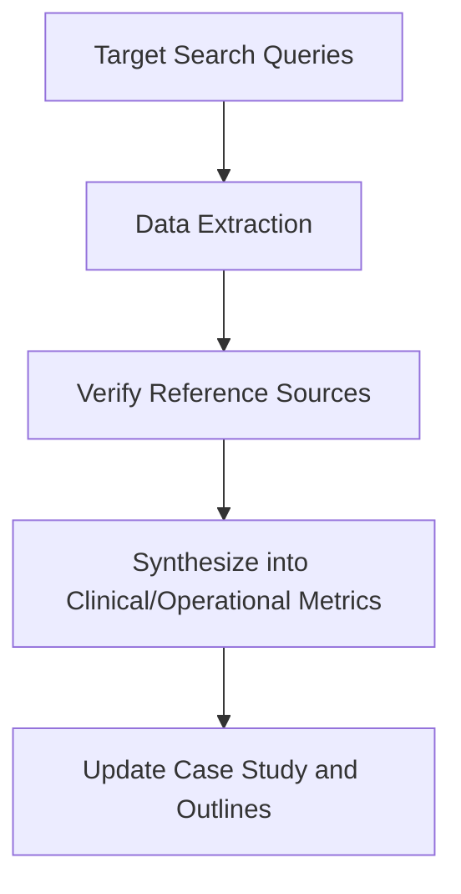

# 08_OSINT_RESEARCH_PLAN: Open Source Intelligence Framework

Operational plan to gather geographic, administrative, and clinical data supporting Book 4 narrative and structural realism.

## 1. Research Objectives

### Objective A: Geographic and Infrastructure Mapping
*   **Target Areas**: Bowtie Narrows, Glendale Narrows riverbed islands, and Long Beach 710 Freeway riverbed sectors.
*   **Data Points**:
    *   Access trails, storm drain egress points, and concrete flood basins.
    *   Satellite maps showing tree canopy density and hidden campsite clearings.
    *   Drainage tunnel sizes and municipal sealing ("bricking off") project schedules.

### Objective B: Jurisdictional and Enforcement Mapping
*   **Target Agencies**: Los Angeles Sheriff's Department (LASD) HOST teams, LAHSA, Mountains Recreation and Conservation Authority (MRCA) Rangers.
*   **Data Points**:
    *   Jurisdictional boundaries between State Parks, County, and City lands along waterways.
    *   Enforcement logs, sweep notices, and trespass protocols.

### Objective C: Environmental and Hydrological Hazard Analysis
*   **Target Sources**: Los Angeles County Department of Public Works, water quality monitoring reports.
*   **Data Points**:
    *   River discharge volumes during storm events and flash flood warnings.
    *   Biological contaminants (coliform, industrial heavy metals) in Glendale Narrows runoff channels.

### Objective D: Animal Companion Policy Audit
*   **Target Agencies**: Los Angeles County Department of Animal Care and Control, pet-friendly interim housing providers.
*   **Data Points**:
    *   Standard operating procedures for pet surrenders during encampment resolutions.
    *   Nonprofit street medicine resources providing veterinary food and care.

### Objective E: Fiscal and Clinical Billing Codes
*   **Target Sources**: California Department of Health Care Services (DHCS) Medi-Cal manuals.
*   **Data Points**:
    *   Billing codes for mobile medicine, street health visits, and ACT team clinical hours.

## 2. Execution Strategy

### Phase 1: Search Queries and Source Lists
*   Query LA County Board of Supervisors agendas for Pathway Home project reports.
*   Extract Point-In-Time (PIT) riverbed survey data.
*   Review California street medicine billing guidelines (Medi-Cal code list).

### Phase 2: Document Archiving
*   Save PDF files and press releases locally in scratch directory.
*   Verify links and extract direct quotes to avoid state drift.
